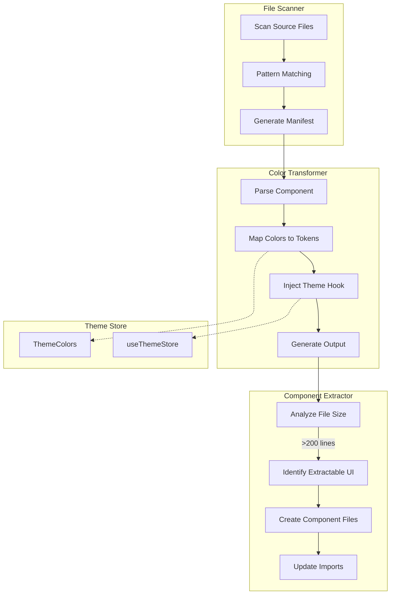

# Design Document: Theme Token Refactor

## Overview

This design describes the systematic refactoring of the Vibeman codebase to replace hardcoded Tailwind `cyan` color classes with theme tokens from the existing `themeStore`. The refactoring enables dynamic theme switching while improving code modularity by extracting UI components from large files.

The existing `themeStore.ts` already defines a comprehensive `ThemeColors` interface with tokens for text, borders, backgrounds, glows, and gradients. The "midnight" theme uses cyan as its base color, making it the ideal reference for mapping hardcoded cyan classes to semantic tokens.

## Architecture



## Components and Interfaces

### 1. Color Pattern Scanner

Responsible for identifying files containing hardcoded cyan color classes.

```typescript
interface ScanResult {
  filePath: string;
  lineCount: number;
  colorPatterns: ColorPattern[];
}

interface ColorPattern {
  line: number;
  column: number;
  original: string;      // e.g., "text-cyan-400"
  category: ColorCategory;
}

type ColorCategory = 'text' | 'border' | 'background' | 'shadow' | 'gradient';

interface ScanManifest {
  totalFiles: number;
  affectedFiles: ScanResult[];
  summary: {
    byCategory: Record<ColorCategory, number>;
    filesOver200Lines: number;
  };
}
```

### 2. Color Token Mapper

Maps hardcoded cyan classes to theme tokens.

```typescript
interface ColorMapping {
  pattern: RegExp;
  category: ColorCategory;
  tokenPath: keyof ThemeColors;
}

const COLOR_MAPPINGS: ColorMapping[] = [
  // Text colors
  { pattern: /text-cyan-200/, category: 'text', tokenPath: 'textLight' },
  { pattern: /text-cyan-300/, category: 'text', tokenPath: 'text' },
  { pattern: /text-cyan-400/, category: 'text', tokenPath: 'textDark' },
  
  // Border colors
  { pattern: /border-cyan-500\/20/, category: 'border', tokenPath: 'borderLight' },
  { pattern: /border-cyan-500\/30/, category: 'border', tokenPath: 'border' },
  { pattern: /border-cyan-500\/50/, category: 'border', tokenPath: 'borderHover' },
  
  // Background colors
  { pattern: /bg-cyan-500\/5/, category: 'background', tokenPath: 'bgLight' },
  { pattern: /bg-cyan-500\/10/, category: 'background', tokenPath: 'bg' },
  { pattern: /bg-cyan-500\/20/, category: 'background', tokenPath: 'bgHover' },
  
  // Shadow/glow colors
  { pattern: /shadow-cyan-500\/\d+/, category: 'shadow', tokenPath: 'glow' },
  
  // Gradient colors
  { pattern: /from-cyan-\d+/, category: 'gradient', tokenPath: 'primaryFrom' },
  { pattern: /via-cyan-\d+/, category: 'gradient', tokenPath: 'primaryVia' },
  { pattern: /to-cyan-\d+/, category: 'gradient', tokenPath: 'primaryTo' },
];
```

### 3. Component Transformer

Transforms components to use theme tokens.

```typescript
interface TransformResult {
  filePath: string;
  originalContent: string;
  transformedContent: string;
  changes: TransformChange[];
  requiresThemeImport: boolean;
}

interface TransformChange {
  line: number;
  original: string;
  replacement: string;
  tokenUsed: keyof ThemeColors;
}
```

### 4. Component Extractor

Extracts UI components from large files.

```typescript
interface ExtractionCandidate {
  name: string;
  startLine: number;
  endLine: number;
  props: PropDefinition[];
  dependencies: string[];
}

interface ExtractionResult {
  originalFile: string;
  extractedComponents: ExtractedComponent[];
}

interface ExtractedComponent {
  name: string;
  filePath: string;
  content: string;
  props: PropDefinition[];
}
```

## Data Models

### Theme Store Integration

The existing `ThemeColors` interface from `themeStore.ts`:

```typescript
interface ThemeColors {
  // Primary gradient
  primary: string;
  primaryFrom: string;
  primaryVia: string;
  primaryTo: string;
  baseColor: string;
  
  // Text colors
  text: string;        // maps to cyan-300 in midnight theme
  textLight: string;   // maps to cyan-200
  textDark: string;    // maps to cyan-400
  
  // Border colors
  border: string;      // maps to cyan-500/30
  borderLight: string; // maps to cyan-500/20
  borderHover: string; // maps to cyan-500/50
  
  // Background colors
  bg: string;          // maps to cyan-500/10
  bgLight: string;     // maps to cyan-500/5
  bgHover: string;     // maps to cyan-500/20
  
  // Shadow/glow
  glow: string;        // maps to shadow-cyan-500/50
  shadow: string;
  
  // Accent colors
  accent: string;
  accentLight: string;
  accentDark: string;
}
```

### File Manifest Schema

```typescript
interface RefactorManifest {
  version: string;
  timestamp: string;
  files: FileEntry[];
}

interface FileEntry {
  path: string;
  status: 'pending' | 'transformed' | 'extracted' | 'complete';
  lineCount: number;
  colorReplacements: number;
  extractedComponents: string[];
}
```

## Correctness Properties

*A property is a characteristic or behavior that should hold true across all valid executions of a system-essentially, a formal statement about what the system should do. Properties serve as the bridge between human-readable specifications and machine-verifiable correctness guarantees.*

Based on the prework analysis, the following properties have been consolidated to eliminate redundancy:

### Property 1: Scanner completeness
*For any* source file containing cyan color patterns, the scanner SHALL identify and catalog all occurrences with their exact class names and line numbers.
**Validates: Requirements 1.1, 1.2**

### Property 2: Color transformation correctness
*For any* hardcoded cyan color class (text, border, background, shadow, or gradient), the transformer SHALL produce the semantically equivalent theme token that renders identically when the midnight theme is active.
**Validates: Requirements 2.1, 2.2, 2.3, 2.4, 2.5, 5.1**

### Property 3: Theme hook injection
*For any* component that uses theme colors after transformation, the component SHALL contain the `useThemeStore` import and properly destructure colors via `getThemeColors()`.
**Validates: Requirements 3.1, 3.2, 6.1, 6.2**

### Property 4: Line count threshold detection
*For any* file exceeding 200 lines after transformation, the system SHALL flag the file for component extraction.
**Validates: Requirements 4.1**

### Property 5: Extraction preserves interface
*For any* extracted component, the original file SHALL import the extracted component, and the extracted component SHALL expose the same props interface as the original inline implementation.
**Validates: Requirements 4.3, 4.4**

### Property 6: Manifest completeness
*For any* scan operation, the resulting manifest SHALL contain entries for all affected files with accurate color pattern counts and line counts.
**Validates: Requirements 1.3**

## Error Handling

### Scanner Errors
- **File read errors**: Log warning and continue with remaining files
- **Pattern matching errors**: Log malformed patterns, skip affected lines
- **Permission errors**: Report inaccessible files in manifest

### Transformation Errors
- **Unmapped color patterns**: Log warning, preserve original class
- **Syntax errors in output**: Validate transformed code, rollback on failure
- **Import conflicts**: Check for existing imports before adding

### Extraction Errors
- **Circular dependencies**: Detect and report, skip extraction
- **Name collisions**: Generate unique component names
- **Props inference failures**: Preserve inline component, log for manual review

## Testing Strategy

### Unit Testing
- Test individual color pattern regex matching
- Test token mapping for each color category
- Test line counting logic
- Test import statement generation

### Property-Based Testing

The project uses `fast-check` for property-based testing as specified in `package.json`.

**Test Configuration:**
- Minimum 100 iterations per property test
- Each test tagged with format: `**Feature: theme-token-refactor, Property {number}: {property_text}**`

**Property Tests:**

1. **Scanner Completeness Test**
   - Generate random file content with known cyan patterns
   - Verify scanner finds all injected patterns
   - Tag: `**Feature: theme-token-refactor, Property 1: Scanner completeness**`

2. **Color Transformation Round-Trip Test**
   - Generate random cyan color classes
   - Transform to theme tokens
   - Verify midnight theme renders same color
   - Tag: `**Feature: theme-token-refactor, Property 2: Color transformation correctness**`

3. **Theme Hook Injection Test**
   - Generate random component structures with color usage
   - Transform and verify useThemeStore presence
   - Tag: `**Feature: theme-token-refactor, Property 3: Theme hook injection**`

4. **Line Count Threshold Test**
   - Generate files of varying lengths
   - Verify files >200 lines are flagged
   - Tag: `**Feature: theme-token-refactor, Property 4: Line count threshold detection**`

5. **Extraction Interface Preservation Test**
   - Generate components with random props
   - Extract and verify props interface matches
   - Tag: `**Feature: theme-token-refactor, Property 5: Extraction preserves interface**`

6. **Manifest Completeness Test**
   - Generate random file sets with cyan patterns
   - Verify manifest contains all files with accurate counts
   - Tag: `**Feature: theme-token-refactor, Property 6: Manifest completeness**`

### Integration Testing
- End-to-end refactoring of sample components
- Visual regression testing with theme switching
- Verify existing test suite passes after refactoring
