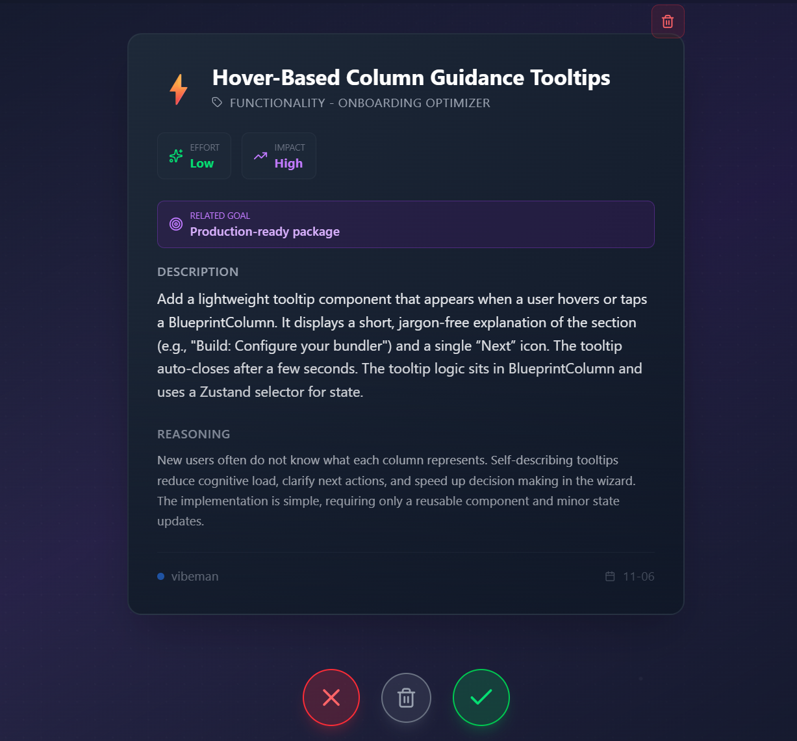

# Vibeman


> *Transform your development workflow with intelligent automation, real-time monitoring, and AI-driven insights*

## Goal
To boost personal productivity in SW development 100x - 1000x by using AI for operations throughout whole lifecycle
- **Planning** -> Idea brainstorming and task refinement
- **Code analysis** -> Static analysis technique + LLM evaluation
- **Implementation** -> Multistream batch code pipelines powered by **Claude Code** 
- **Tests** -> Automated tests in package, so we can focus on pure development

### Challenges
1. **How to generate valuable and creative ideas** 
- By proper feature separation into **Contexts** with defined structure and solid documentation. 
- By multidimensional analysis, using AI agents in 10 different roles (prompts) looking at the feature's opportunities from different perspectives
2. **How to produce 1000x code then myself in reasonable quality**
- Let **Claude Code** cook, it can do it if each requirement file is well generated and skills defined to follow codebase's best practices. **PRECONDITION:** Claude Code MAX plan needed for power usage = autonomous running whole day in one or multiple threads to develop more codebases at once.
3. **How to mentally manage such rapid development**
- UI to wrap complex scans into simple experience, provide valuable development metrics and easy options to overview and handle multiple projects at once
- AI assistant to periodically scan and plan next steps on behalf of user -> User has to become "high level manager" in this environment = decisions based on results, not on the solution detail -> we need to be able to rely on AI mass development won't go sideways


## 🏗️ Architecture

### **Frontend Stack**
- **Next.js 16** for all round client and server operations relying on interactions with local files. Unsafe to run outside the localhost but simple and efficient architecture for static analysis and direct manipulation with the codebase. 
- **TypeScript** for type-safe development
- **Tailwind CSS** for responsive, utility-first styling
- **Framer Motion** for smooth animations and transitions
- **Zustand** for lightweight state management

### **Backend & Data**
- **SQLite** with Better-SQLite3 for local data persistence
- **LLM Integration** multi-LLM provider for less complex operations in terms of iterations (one-shot prompts, AI assistant). Supported: Gemini Flash latest, Claude Haiku 4.5, GPT 5, **Ollama with gpt-oss:20** (go to solution for )

## 🎯 Core Feeatures

### **The Blueprint**
UI with a set of scan tools for code understanding and improvements
- High level documentation generation
- Feature scan
- Code structure static analysis
- Automated testing flows


### **Context Management**
- Manage large codebases in instant view composed by AI


### **Idea generator**
- Populate backlog with implementation ideas evaluated by 10+ AI agents with different specialization 
- Supports Ollama models for infinite runs for free


### **Idea tinder**
- Quicky evaluate auto-produced backlog with tinder-like experience -> keyboard shortcuts, swipe gestures
- Accepted ideas will be refined in the background, ready for development



### **Task Runner**

- Pick refined requirements to code
- Batch requirements into multiple parallel queues
- Claude Code will: Code, Test, Commit, Document


### **Refactor wizzard**
- Don't know what to develop, run this powerful static analysis scan and populate backlog with useful refactor


## 🛠️ Getting Started

### **Prerequisites**
- Node.js 18+ 
- npm or yarn package manager
- Git for repository management

### **Installation**
```bash
# Clone the repository
git clone <repository-url>
cd vibeman

# Install dependencies
npm install

# Start development server
npm run dev
```

### **Configuration**
1. **Environment Setup**: Configure API keys for AI services (OpenAI, etc.)
2. **Project Paths**: Set up base paths for project discovery
3. **Database**: SQLite databases are created automatically on first run