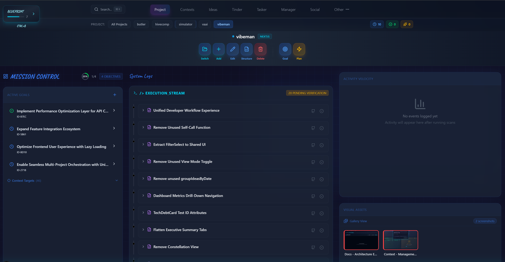
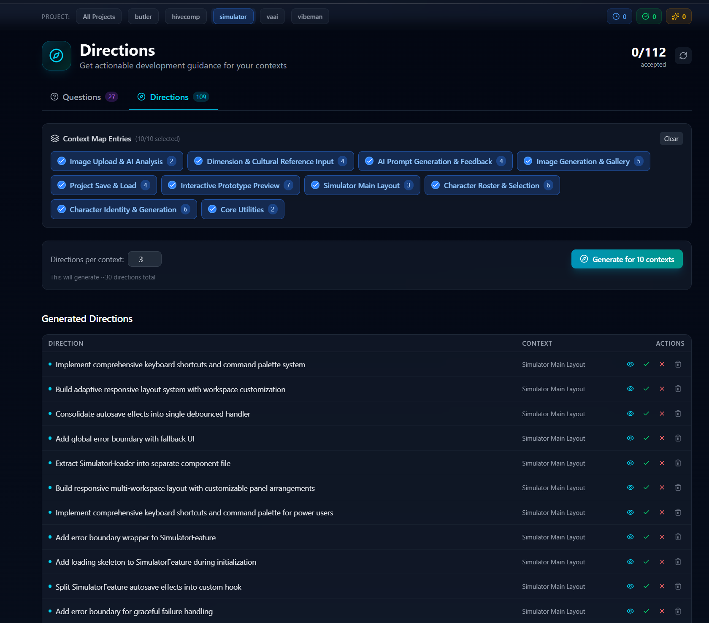
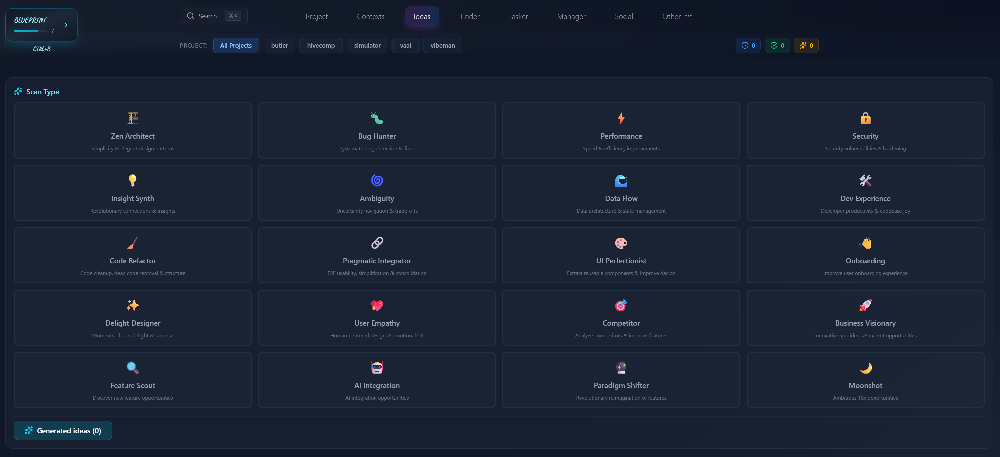
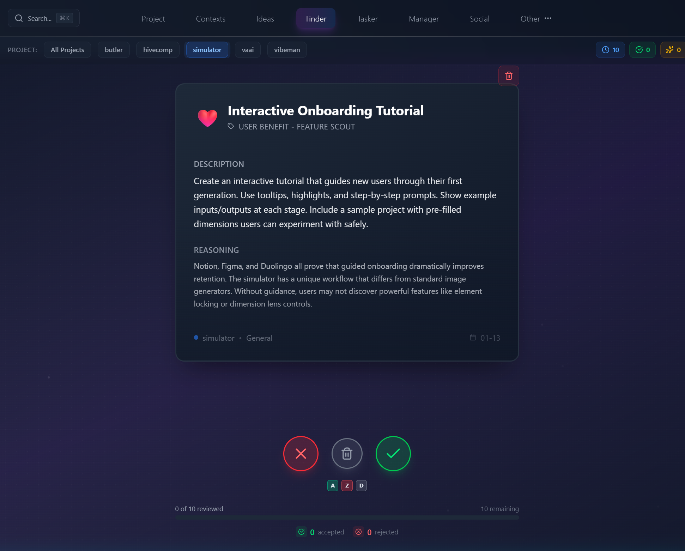
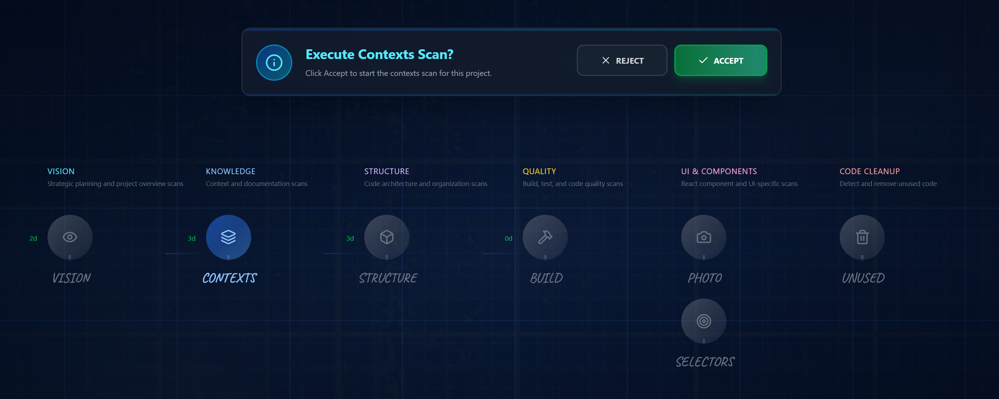
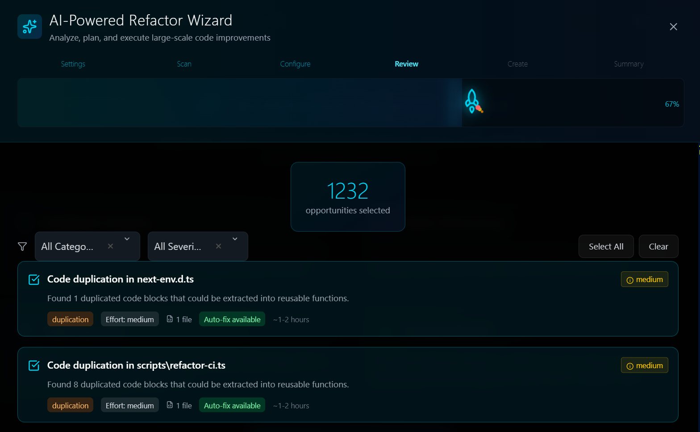
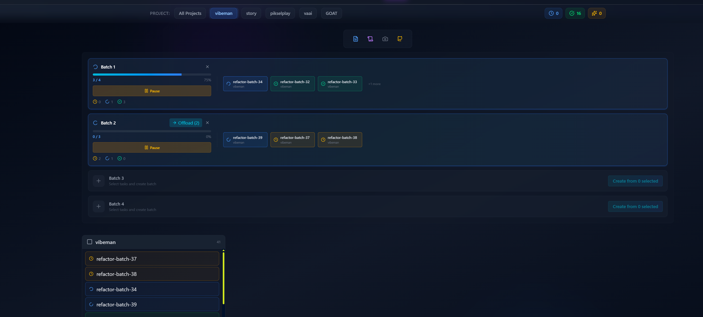
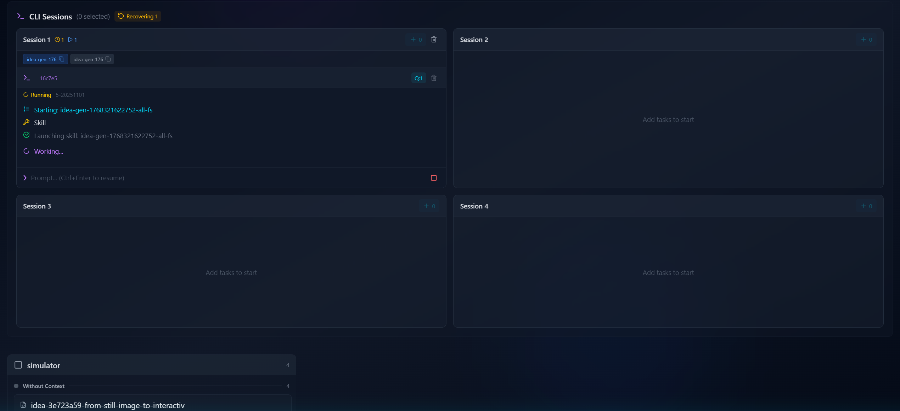
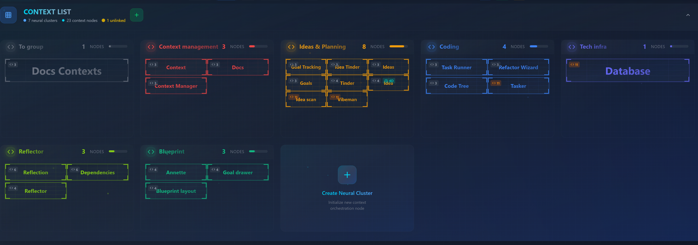

**AI-Driven End-to-End Software Development Lifecycle Automation**

> Boost personal developer productivity 100x through intelligent automation at every stage of the development lifecycle.

```
┌─────────────┐    ┌─────────────┐    ┌─────────────┐    ┌──────────────┐    ┌─────────────┐
│  FEEDBACK   │───▶│ REQUIREMENT │───▶│   BACKLOG   │───▶│IMPLEMENTATION│───▶│    TEST     │
│             │    │             │    │    IDEA     │    │              │    │             │
└─────────────┘    └─────────────┘    └─────────────┘    └──────────────┘    └─────────────┘
     ▲                                                                              │
     └──────────────────────────────────────────────────────────────────────────────┘
                              Continuous Feedback Loop
```

---

## Vision

Transform the developer from a code writer into a **high-level technical manager** who:
- Makes decisions based on **results**, not implementation details
- Relies on AI to handle the volume of development work
- Maintains quality through automated validation and oversight

---

## Lifecycle Stages

### 1. FEEDBACK — Capturing User & Stakeholder Input

**Vision:** Aggregate feedback from all channels into a unified queue for AI processing.

**Current State:**

- Multiproject support - Develop up to 20 projects in parallel




**Halfway there:**
- Social Kanban Board with multi-channel support (chat, email, Facebook, Instagram, X/Twitter, reviews)
- Twitter/X discovery integration for relevant discussions
- Activity timeline with SLA tracking and aging indicators
- AI-generated clarifying questions and proposed directons for ambiguous feedback



**Future Directions:**
- Helpdesk integrations (Zendesk, Intercom)
- Automated feedback from technical monitoring
- App store review aggregation (iOS/Android)
- Slack/Discord bot for real-time capture

---

### 2. REQUIREMENT — Translating Feedback into Actionable Work

**Vision:** Transform raw feedback into structured, validated requirements with clear acceptance criteria.

**Current State:**
- Goals Management with full lifecycle tracking (open → in_progress → done)
- Goal Hub dashboard with hypothesis testing and activity feeds


- Claude Code requirement files for AI implementation

**Halfway there:**
- Strategic Roadmap for milestone visualization

**Future Directions:**
- AI-generated acceptance criteria
- GitHub Issues bi-directional sync

---

### 3. BACKLOG IDEA — Generating & Evaluating Improvements

**Vision:** Continuous AI analysis surfacing improvement opportunities, prioritized by effort/impact.


**Current State:**
- **Specialized AI Agents** generating ideas:



- **Tinder-Style Evaluation** — Swipe to accept/reject with LLM suggestions



- **Blueprint Scanning** — Multi-type codebase analysis:
  - Structure, Build, Context, Vision scans
  - Unused file detection
  - Per-feature deep analysis



- **Refactor Wizard** — Multi-step pipeline:
  - Scan → Review → Plan → Package → Execute
  - Map-Reduce pattern for large-scale analysis



- **Tech Debt Radar** — Severity scoring with remediation planning
- **Debt Prediction** — ROI simulation for refactoring decisions

**Future Directions:**
- ML-based quality scoring from accept/reject patterns
- Semantic deduplication
- Context-aware generation (only for modified files)

---

### 4. IMPLEMENTATION — Executing the Work

**Vision:** Zero-friction implementation through AI coding with automatic context updates.



**Current State:**
- **Claude Code Execution** — Headless integration:
  - Requirement file management (`.claude/requirements/`)
  - Execution queue with session management
  - Auto-update contexts from file changes

- **Task Runner** — Batch execution:
  - Dual panel UI (selection + status)
  - States: queued → running → completed/failed
  - Git auto-commit after tasks
  - Screenshot capture for validation
  - Remote delegation for distributed execution
  - CLI mode with session management to batch tasks in one memory context



---

### 5. TEST — Validating the Implementation

**Vision:** Automated validation at every level with self-healing capabilities.

**Current State:**
- **Context Testing** — Screenshot-based validation:
  - Test scenario editor
  - BrowserBase integration for automation
  - Visual comparison capabilities

- **Blueprint Test Scans**:
  - AI-generated test scenarios
  - Visual regression detection
  - Per-context code review

- **Autonomous CI Dashboard**:
  - Pipeline monitoring
  - Build predictions
  - Flaky test detection

- **Project Health Metrics**:
  - Health score gauges
  - Trend analysis
  - Security vulnerability breakdown

- **Build Fixer** — AI-assisted error resolution

**Future Directions:**
- E2E test generation from context definitions
- Visual regression baseline management
- Test impact analysis (which tests for which changes)
- Accessibility automation (WCAG compliance)
- Self-healing UI locators
- SAST/DAST security scanning integration

---

## Supporting Infrastructure

### Context System
The foundation — organizing code into business feature "contexts" that flow through the entire lifecycle.



- **Context Cards** — Visual representation of code areas
- **Context Groups** — Color-coded organization by layer
- **Context Auto-Update** — Automatic mapping after implementations


## Tech Stack

| Layer | Technology |
|-------|------------|
| Frontend | Next.js 16, React 19, TypeScript |
| Styling | Tailwind CSS, Framer Motion |
| State | Zustand (21 stores) |
| Database | SQLite (WAL mode) |
| AI | OpenAI, Anthropic, Gemini, Ollama |
| Testing | Vitest, BrowserBase |


### Database
SQLite databases are created automatically on first run. No manual setup required.

---

## Local Setup

### Prerequisites

```bash
npm install
npm run dev        # Start the development server on http://localhost:3000
```

### CLI Providers

The Task Runner supports multiple CLI providers for executing implementation tasks. Each provider uses a different AI backend but integrates through the same SSE-based streaming UI.

#### Claude Code CLI (Default)

The primary provider. Uses Anthropic's Claude models via the `claude` CLI.

```bash
# Install Claude Code CLI
npm install -g @anthropic-ai/claude-code

# Verify installation
claude --version

# Auth: uses web-based subscription auth by default.
# For API key auth, set ANTHROPIC_API_KEY in .env
```

**Models:** Opus, Sonnet

---

#### Gemini CLI

Uses Google's Gemini models via the `gemini` CLI.

```bash
# Install Gemini CLI
npm install -g @google/gemini-cli

# Verify installation
gemini --version

# Auth: run 'gemini' once interactively to complete OAuth login,
# or set GEMINI_API_KEY in .env
```

**Models:** Gemini 3.1 Pro Preview

---

#### Ollama (via Claude CLI)

Routes Claude CLI through a local Ollama instance. Ollama exposes an Anthropic-compatible Messages API at `/v1/messages`, so Claude CLI works transparently with Ollama-hosted models.

```bash
# Install Ollama: https://ollama.com/download
# Start Ollama (runs on http://localhost:11434 by default)

# Pull the cloud model
ollama pull qwen3.5:cloud

# For cloud models, authenticate:
ollama login
# Or visit the signin URL shown when accessing a cloud model

# Optional: configure in .env
OLLAMA_BASE_URL=http://localhost:11434
OLLAMA_API_KEY=ollama
```

**Models:** Qwen 3.5 Cloud

**How it works:** When you select "Ollama" as the provider, Vibeman spawns `claude` CLI with `ANTHROPIC_BASE_URL` pointed at your Ollama instance and `--model qwen3.5:cloud`. The Claude CLI handles the agentic loop while Ollama serves the model.

---

#### VS Code Copilot Bridge

Leverages GitHub Copilot subscription models (GPT-5.3 Codex, Claude Opus 4.6, GPT-4.1) through a lightweight VS Code extension that exposes Copilot's `vscode.lm` API over HTTP.

```bash
# 1. Build the extension
cd vibeman-bridge
npm install
npm run compile

# 2. Package as .vsix
npx @vscode/vsce package --allow-missing-repository

# 3. Install in VS Code / VS Code Insiders
code --install-extension vibeman-bridge-0.1.0.vsix
# or for Insiders:
code-insiders --install-extension vibeman-bridge-0.1.0.vsix

# 4. Reload VS Code (Ctrl+Shift+P -> "Developer: Reload Window")

# 5. Verify: the extension auto-starts and runs on port 9876
curl http://localhost:9876/health
```

**Models:** GPT 5.3 Codex (1x), Claude Opus 4.6 (3x), GPT 4.1 (0x)

**Requires:** Active GitHub Copilot subscription in VS Code.

**Updating after code changes:**
```bash
cd vibeman-bridge
npm run compile
npx @vscode/vsce package --allow-missing-repository
code-insiders --install-extension vibeman-bridge-0.1.0.vsix
```

---

## Architecture

```
src/
├── app/
│   ├── api/              # 158+ API routes
│   ├── db/               # Database layer
│   ├── Claude/           # Claude Code integration
│   └── features/         # Feature modules
│       ├── Social/           # FEEDBACK
│       ├── Manager/          # REQUIREMENT
│       ├── Ideas/            # BACKLOG IDEA
│       ├── TaskRunner/       # IMPLEMENTATION
│       ├── AutonomousCI/     # TEST
│       └── Context/          # Cross-cutting
├── stores/               # 21 Zustand stores
└── lib/
    └── llm/              # LLM provider clients
```

---

## Warning

Vibeman is a **localhost-only application** designed for local development workflows. It performs direct file system operations and database queries.

**Never deploy to production environments accessible over the internet.**

---

## License

MIT License — See [LICENSE](LICENSE) for details.
