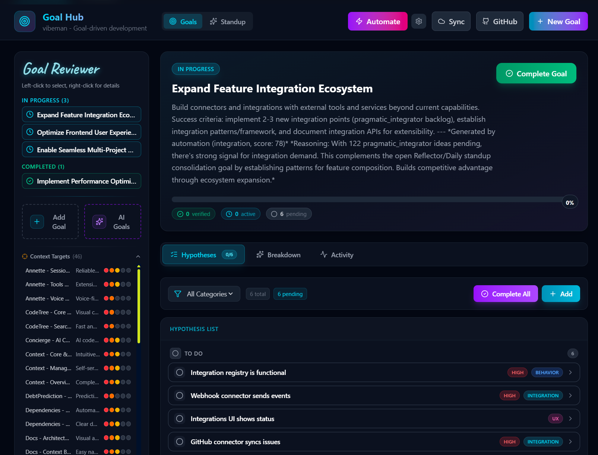
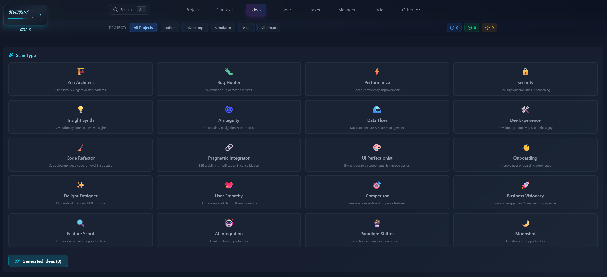
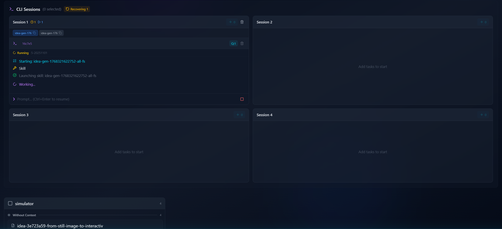
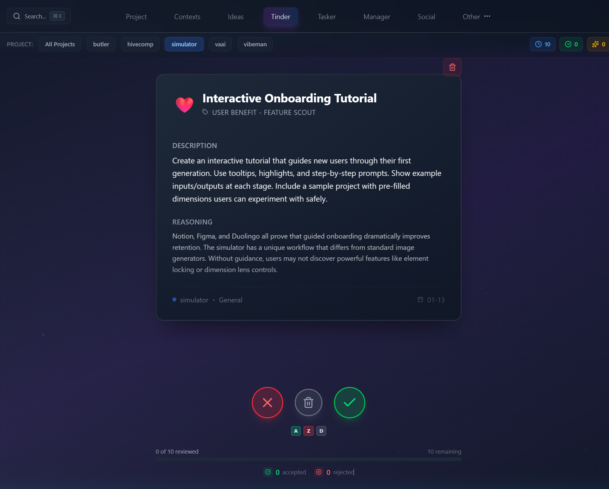
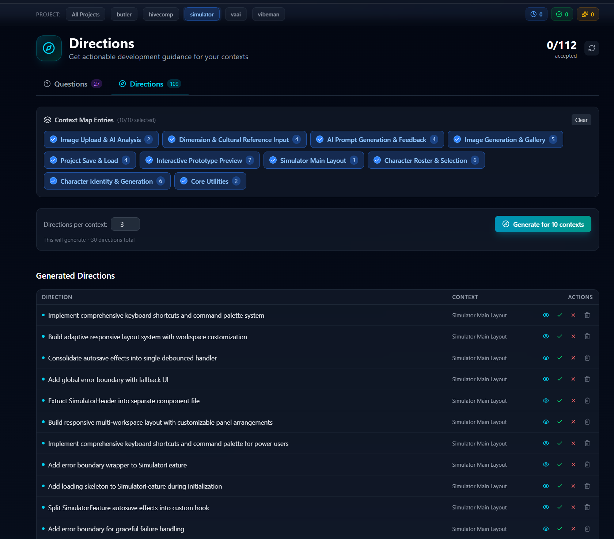
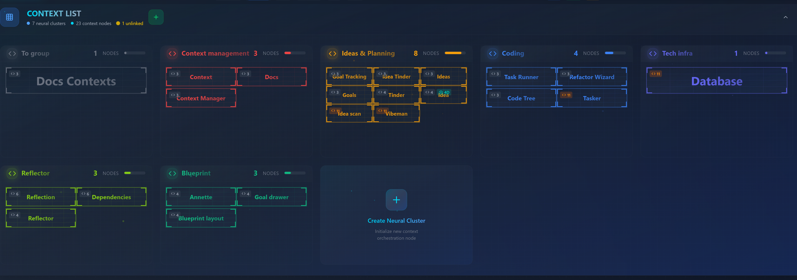

# Vibeman

**AI-Driven End-to-End Software Development Lifecycle Automation**

> Transform from a code writer into a high-level technical manager. Let AI handle the volume of development work while you make decisions based on results.

[](LICENSE)
[](https://nodejs.org/)
[](https://nextjs.org/)
[](https://www.typescriptlang.org/)

```
┌─────────────┐    ┌─────────────┐    ┌─────────────┐    ┌──────────────┐    ┌─────────────┐
│  FEEDBACK   │───>│ REQUIREMENT │───>│   BACKLOG   │───>│IMPLEMENTATION│───>│    TEST     │
│             │    │             │    │    IDEA     │    │              │    │             │
└─────────────┘    └─────────────┘    └─────────────┘    └──────────────┘    └─────────────┘
     ^                                                                              │
     └──────────────────────────────────────────────────────────────────────────────┘
                              Continuous Feedback Loop
```

---

## What is Vibeman?

Vibeman is a **localhost-first** application that orchestrates your entire software development lifecycle through AI. It connects feedback capture, requirement planning, idea generation, implementation, and testing into a single automated pipeline.

### Key Features

- **Multi-Provider AI Execution** — Run tasks across Claude, Gemini, Copilot, and Ollama simultaneously with 4 concurrent CLI sessions
- **Conductor Pipeline** — Adaptive 3-phase cycle (Plan -> Dispatch -> Reflect) with self-healing error recovery
- **Codebase Scanning** — AI agents analyze your code for improvements across structure, build, context, and vision dimensions
- **Tinder-Style Idea Evaluation** — Swipe to accept/reject AI-generated improvement suggestions
- **Goal & Requirement Tracking** — Full lifecycle management with optional GitHub Projects sync
- **Task Runner** — Batch execution with real-time SSE streaming, auto-commit, and screenshot validation
- **Context System** — Organize code into business feature "contexts" that flow through the entire lifecycle
- **Brain Dashboard** — Behavioral learning with anomaly detection, correlation analysis, and activity heatmaps
- **Voice Assistant (Annette)** — AI-powered voice companion with chat, voice lab, and autonomous agent modes
- **Multi-Project Support** — Manage up to 20 projects in parallel

### Screenshots

| Goals | Ideas | Task Runner |
|-------|-------|-------------|
|  |  |  |

| Tinder Evaluation | Feedback | Contexts |
|-------------------|----------|----------|
|  |  |  |

---

## Quick Start

```bash
# 1. Clone the repository
git clone https://github.com/your-username/vibeman.git
cd vibeman

# 2. Install dependencies
npm install

# 3. Configure environment
cp .env.example .env.local
# Edit .env.local — at minimum, set one LLM provider API key

# 4. Start the development server
npm run dev
```

Open [http://localhost:3000](http://localhost:3000). The SQLite database is created automatically on first run — no manual setup required.

---

## Prerequisites

### Required

| Requirement | Notes |
|-------------|-------|
| **Node.js 20+** | Required for Next.js 16 and `better-sqlite3` native compilation |
| **npm** | Comes with Node.js |
| **C/C++ build tools** | Required by `better-sqlite3` native addon (see platform-specific below) |

### Platform-Specific Build Tools

**Windows:**

| Requirement | Install |
|-------------|---------|
| Build Tools | `npm install -g windows-build-tools` or install Visual Studio Build Tools with "Desktop development with C++" workload |
| Python 3 | Required by `node-gyp` (included with Visual Studio Build Tools) |

**macOS:**

```bash
xcode-select --install
```

**Linux (Debian/Ubuntu):**

```bash
sudo apt install build-essential python3
```

For other distros, install `gcc`, `g++`, `make`, and `python3`.

---

## Environment Variables

Copy `.env.example` to `.env.local` and configure:

### LLM Providers (at least one required)

| Variable | Description |
|----------|-------------|
| `ANTHROPIC_API_KEY` | Anthropic API key for Claude models |
| `GEMINI_API_KEY` | Google Gemini API key |
| `OPENAI_API_KEY` | OpenAI API key |
| `OLLAMA_BASE_URL` | Ollama server URL (default: `http://localhost:11434`) |

### Database

| Variable | Default | Description |
|----------|---------|-------------|
| `DATABASE_URL` | `./database/vibeman.db` | SQLite database file path |
| `DB_DRIVER` | `sqlite` | Database driver |

### Optional Integrations

| Variable | Description |
|----------|-------------|
| `NEXT_PUBLIC_SUPABASE_URL` | Supabase project URL (cloud sync) |
| `NEXT_PUBLIC_SUPABASE_ANON_KEY` | Supabase anonymous key |
| `GITHUB_TOKEN` | GitHub PAT for Projects sync (`project:read`, `project:write` scopes) |
| `ELEVENLABS_API_KEY` | ElevenLabs API key (voice assistant) |
| `BROWSERBASE_API_KEY` | BrowserBase API key (automated screenshots) |

See `.env.example` for the full list with descriptions.

---

## CLI Providers

The Task Runner dispatches work to multiple AI CLI providers. Each is optional — install only what you need.

### Claude Code CLI (Primary)

```bash
npm install -g @anthropic-ai/claude-code
claude --version
```

Uses Anthropic's Claude models via headless CLI with `--output-format stream-json`.

### Gemini CLI

```bash
npm install -g @google/gemini-cli
gemini --version
# Run 'gemini' once interactively to complete OAuth login, or set GEMINI_API_KEY
```

### Ollama (via Claude CLI)

Routes Claude CLI through a local Ollama instance. Requires both `claude` CLI and `ollama` installed.

```bash
# Install Ollama: https://ollama.com/download
ollama serve
ollama pull qwen3.5:cloud
```

### VS Code Copilot Bridge

Leverages GitHub Copilot subscription models through a VS Code extension. See `vibeman-bridge/README.md` for setup instructions.

---

## Available Scripts

| Script | Description |
|--------|-------------|
| `npm run dev` | Start dev server with Turbopack |
| `npm run build` | Production build |
| `npm start` | Start production server |
| `npm test` | Run test suite (Vitest) |
| `npm run lint` | Run ESLint |
| `npm run build:mcp` | Compile MCP server |
| `npm run security:audit` | Run dependency security audit |

---

## Tech Stack

| Layer | Technology |
|-------|------------|
| **Framework** | Next.js 16 (App Router, Turbopack) |
| **Language** | TypeScript 5.9 (strict mode) |
| **UI** | React 19, Tailwind CSS 4, Framer Motion |
| **State** | Zustand with persist middleware |
| **Database** | SQLite via better-sqlite3 (WAL mode) |
| **Data Fetching** | TanStack React Query |
| **AI Providers** | Anthropic, Google Gemini, GitHub Copilot, Ollama |
| **Visualization** | Recharts, D3, React Flow |
| **Testing** | Vitest, fast-check (property-based) |
| **Drag & Drop** | dnd-kit |

---

## Project Structure

```
src/
├── app/
│   ├── api/                # API routes (50+ endpoint groups)
│   ├── db/                 # Database layer (connection, migrations, repositories)
│   └── features/           # Feature modules (22 features)
│       ├── Conductor/      # Adaptive AI pipeline (Plan → Dispatch → Reflect)
│       ├── TaskRunner/     # Multi-provider task execution
│       ├── Goals/          # Requirement lifecycle tracking
│       ├── Ideas/          # AI-generated improvement suggestions
│       ├── Context/        # Code section management
│       ├── Brain/          # Behavioral learning dashboard
│       ├── Annette/        # Voice assistant
│       ├── Social/         # Multi-channel feedback
│       ├── Manager/        # Implementation review
│       ├── RefactorWizard/ # Multi-step refactoring pipeline
│       └── ...             # More features
├── components/             # Shared UI components
├── hooks/                  # Custom React hooks
├── lib/                    # Business logic and utilities
├── stores/                 # Zustand state stores
├── types/                  # TypeScript type definitions
└── prompts/                # LLM prompt templates
```

See [ARCHITECTURE.md](ARCHITECTURE.md) for a detailed technical deep-dive.

---

## Cross-Platform Notes

Vibeman runs on **Windows**, **macOS**, and **Linux**.

- **Process spawning:** On Windows, CLI subprocesses use `shell: true` to resolve `.cmd`/`.exe` wrappers. On macOS/Linux, `shell: false` resolves binaries directly from PATH.
- **Database:** SQLite via `better-sqlite3` compiles native bindings on `npm install`. The DB file is created automatically relative to project root.
- **File paths:** All server-side path construction uses Node.js `path.join()` / `path.resolve()`. No hardcoded separators.

---

## Security Notice

Vibeman is a **localhost-only application** designed for local development workflows. It performs direct file system operations, spawns subprocesses, and runs database queries with full local access.

**Never deploy to production environments accessible over the internet.**

---

## Contributing

We welcome contributions! Please read [CONTRIBUTING.md](CONTRIBUTING.md) for development setup, coding standards, and the pull request process.

---

## License

MIT License — See [LICENSE](LICENSE) for details.
