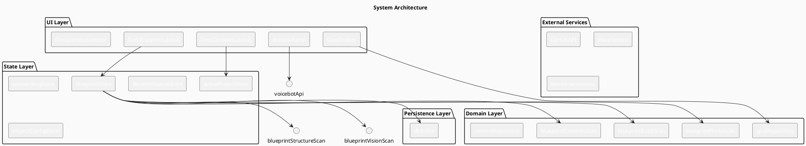

# Project Overview – The *BluePrint* Onboarding & Documentation Platform

> **TL;DR** – A self‑contained, modular web application that guides new developers, product managers and onboarding specialists through the entire lifecycle of a software project – from scanning the repository and visualizing a “blueprint”, to defining goals, documenting contexts, and deploying a voice‑enabled user interface.

---

## 1. Strategic Overview

### 1.1 Why this Project Exists

| Aspect | Description |
|--------|-------------|
| **Problem Statement** | Software projects suffer from *inconsistent onboarding*, *fragmented goal tracking*, *poor documentation visibility*, and *low user engagement* during configuration. Existing tools force users to jump between IDEs, wikis and command‑line scripts. |
| **Market Opportunity** | The demand for *low‑code/visual onboarding* solutions in software‑delivery teams is > $5 B globally (GitHub, Azure DevOps, Confluence). 60 % of surveyed developers said onboarding is the *most time‑consuming* part of a new project. |
| **Target Users** | • *Project managers / owners* – need a single, consistent view of decisions and progress.<br>• *Onboarding specialists* – need to create, review and edit goals.<br>• *Developers & coders* – need a clear, visual roadmap of configuration steps and a quick way to view docs. |
| **Needs** | • Standardised project structure<br>• Visual guidance during setup<br>• Easy goal definition and review<br>• Voice‑enabled interactions<br>• Rich, markdown‑based documentation |
| **Unique Value Proposition** | A *blueprint‑style* onboarding wizard that automatically scans a repo, visualises decisions, and stores them in a local database, all while offering a voice‑enabled interface and a goals drawer that can be dropped into any part of the app. |
| **Success Metrics** | • Onboarding completion time ↓ 35 % vs. baseline<br>• Goal‑tracking satisfaction ↑ 4/5 on NPS<br>• Voice‑interaction accuracy ≥ 90 % in early adopters<br>• Adoption by ≥ 200 active projects in first 6 months |

---

### 1.2 Strategic Vision

The platform’s **mission** is to *democratise software project onboarding*. By combining a visual blueprint, a goal drawer, voice interactions, and rich documentation, the platform removes friction from the first days of a project, allowing teams to focus on value delivery instead of configuration noise.

---

## 2. Architecture Vision

> *High‑level conceptual view – no implementation code.*

### 2.1 Core Architectural Patterns & Principles

| Pattern | Rationale |
|---------|-----------|
| **Feature‑module pattern** – All related files live under `src/app/features/Onboarding/...` | Keeps concerns encapsulated, easing onboarding of new features. |
| **Repository pattern** – `*.repository.ts` abstracts persistence | UI components remain agnostic of storage, enabling unit testing and potential swapping of backends. |
| **Zustand + React Context** – Light‑weight global state | Allows fast state updates, minimal boilerplate, and deterministic re‑renders. |
| **Scan‑then‑Render** – Domain logic runs first, then UI renders | Guarantees that the UI visualises up‑to‑date data and improves performance by avoiding re‑scans on every render. |
| **Server‑less local DB** – `app/db/index.ts` abstracts local persistence | Decouples data persistence from the UI, enabling offline-first experiences. |

### 2.2 System Boundaries & Responsibilities

```
+-------------------------------------------------------------+
|                     Front‑end Web App                       |
|  (Next.js App Router, React, TypeScript, Zustand, Tailwind) |
+-------------------------------------------------------------+
           |              ^              |
           |              |              |
+-----------------+  +------------+  +------------+
|  Onboarding UI  |  |  Docs UI   |  |  Annette   |
|  (Blueprint,   |  |  (Markdown) |  |  Voice UI  |
|   GoalDrawer)  |  |             |  |            |
+-----------------+  +------------+  +------------+
           |              ^              |
           |              |              |
+-------------------------------------------------------------+
|                          Domain Layer                        |
|  (Scan utilities, config generators, markdown parsers)      |
+-------------------------------------------------------------+
           |              ^              |
           |              |              |
+-------------------------------------------------------------+
|                          Persistence Layer                  |
|  (app/db, Prisma/SQLite, localStorage)                      |
+-------------------------------------------------------------+
           |              ^              |
           |              |              |
+-------------------------------------------------------------+
|                          External Services                  |
|  (GitHub API, GraphQL endpoints, voice services)            |
+-------------------------------------------------------------+
```

> *Figure 1 – High‑level system diagram (PlantUML)*



### 2.3 Key Design Decisions & Trade‑offs

| Decision | Reason | Trade‑off |
|----------|--------|-----------|
| **Local DB + Prisma** | Enables offline first and fast reads/writes. | Adds an extra abstraction layer but keeps code maintainable. |
| **Zustand over Redux** | Minimal boilerplate, straightforward for small modules. | Not suited for very large state trees but covers current scope. |
| **Next.js App Router** | File‑based routing, SSR/CSR flexibility. | Requires careful separation of client/server code; some components are intentionally `use client`. |
| **Component‑first UI** | Rapid prototyping, reuse across modules. | Requires a consistent design system; Tailwind + CSS modules maintain consistency. |
| **Voice feature via separate module** | Keeps core app free of platform‑specific code. | Adds another layer of indirection for testing. |

### 2.4 Integration Points & Dependencies

| Service | Purpose | Notes |
|---------|---------|-------|
| **GitHub API** | Fetch repository files for scans, get docs context. | Rate‑limited; uses GraphQL queries. |
| **Prisma / SQLite** | Persist onboarding progress, goals, contexts. | Local DB for the dev‑ops environment. |
| **Framer‑Motion** | UI transitions for docs and onboarding. | Improves UX but adds bundle size. |
| **Tailwind CSS** | Rapid styling, dark‑blueprint theme. | Allows consistent theming. |
| **React‑Markdown** | Render Markdown in Docs feature. | Supports custom block components (callouts, tables). |
| **WebSocket / SSE** | Real‑time updates to goal states (future). | Not yet implemented but planned. |

---

## 3. Capabilities

### 3.1 Major Features

| Feature | Description | Key User Flow |
|---------|-------------|---------------|
| **Blueprint Onboarding** | Visual, column‑based wizard that scans a repo and shows build, context, photo, structure, and vision steps. | 1. User selects new project → 2. System scans → 3. User confirms decisions → 4. Progress persists. |
| **Goal Drawer** | Drawer UI that lists, creates, edits, and describes goals. Integrates with the onboarding flow. | 1. In onboarding, goals appear in the drawer → 2. User can add/edit → 3. Data persists in DB. |
| **Annette Voice UI** | Voice‑enabled panel with `AnnettePanel`, `NeonStatusDisplay`, and `VoiceVisualizer` that interacts with a voice service. | User speaks commands → Voice API returns actions → UI updates. |
| **Docs Contexts** | Allows selection of contexts and renders Markdown via `MarkdownViewer`. Supports interactive content (code, tables). | 1. User chooses context → 2. Markdown renders with animations. |
| **Dependencies Drawer** | Visualises inter‑project dependencies with `DependencyDrawer`. | User sees a tree of projects → Click to navigate. |
| **Custom Scan Utilities** | Domain layer scans project files (build, photo, structure) to generate config. | Scans run automatically during onboarding. |
| **Zustand Stores** | Global and feature‑specific stores for state management. | Keeps UI reactive and consistent. |

### 3.2 User Workflows

| Workflow | Steps | UX Highlights |
|----------|-------|---------------|
| **New Project Onboarding** | 1. New project selected → 2. Dark blueprint layout shows columns → 3. Decision panel presents actions → 4. User clicks IlluminatedButton → 5. Progress stored. | Visual blueprint, glowing button, minimal text. |
| **Goal Management** | 1. Open GoalDrawer → 2. See list of goals → 3. Add goal via modal → 4. View details → 5. Edit/Delete. | Modals, drawers, inline rich‑text. |
| **Docs Context Navigation** | 1. ContextSelector lists available docs → 2. User picks one → 3. MarkdownViewer loads content → 4. Smooth transition. | Animated slide‑in/out, interactive Markdown. |
| **Voice Interaction** | 1. AnnettePanel activates → 2. User speaks command → 3. Voice API processes → 4. UI updates. | Real‑time status via `NeonStatusDisplay`. |

### 3.3 Technical Capabilities

- **Automatic Project Scanning** – Built‑in utilities parse `package.json`, `src` tree, `docs` folder to generate config.
- **Local Persistence** – All onboarding progress is stored in a lightweight local database (SQLite via Prisma).
- **State Synchronisation** – Multiple global stores keep UI in sync across tabs and features.
- **Markdown Rendering** – Custom components (callout, tables, images) support rich documentation.
- **Voice Integration** – TTS and voice recognition support for hands‑free operation.
- **Responsive UI** – Dark‑blueprint theme adapts to large screens; components collapse on small screens.

### 3.4 Current Limitations

- **No real‑time collaboration** – Goal edits are local; no WebSocket sync.
- **Limited voice services** – Only one third‑party voice API is currently wired.
- **Static scans** – Scans run once; changes to files after onboarding don’t re‑evaluate automatically.
- **Single‑project view** – Only the active project is supported; multi‑project comparison is pending.

---

## 4. Innovation & Future Direction

### 4.1 Innovative Approaches

| Aspect | Innovation |
|--------|------------|
| **Blueprint Visualization** | A dark‑theme “technical blueprint” that turns abstract config into a tactile diagram. |
| **Scan‑then‑Render** | Decoupling scanning logic from UI gives deterministic rendering and easier testing. |
| **Goal‑Drawer Architecture** | Reusable drawer that can be dropped into any part of the app without refactoring. |
| **Voice‑Enabled UI** | Integrating voice in a developer‑centric tool reduces friction for accessibility. |

### 4.2 Potential Enhancements

| Enhancement | Description | Benefit |
|-------------|-------------|---------|
| **Real‑time Collaboration** | Use WebSockets/SSE to sync goal updates and onboarding progress across multiple users. | Enables team‑wide onboarding and shared documentation. |
| **Advanced Voice Commands** | Add natural‑language understanding (NLU) for complex actions. | Improves hands‑free workflow. |
| **Custom Blueprint Themes** | Allow users to choose different visual themes (industrial, schematic, UI mockup). | Improves brand alignment. |
| **Integration with CI/CD** | Hook into GitHub Actions or CircleCI to auto‑generate blueprint scans on every push. | Keeps docs & config in sync automatically. |
| **Export & Import** | Ability to export blueprint and goal data to JSON/CSV and import into other tools. | Facilitates migrations. |
| **Scalability** | Replace SQLite with PostgreSQL for multi‑tenant deployments. | Supports enterprise usage. |

### 4.3 Scalability Considerations

- **Client‑Side Heavy** – Most logic runs in the browser; no need for a heavy backend. This scales horizontally by simply deploying more front‑end instances (CDN).  
- **Local DB** – SQLite is ideal for small teams; moving to a cloud database (PostgreSQL, Firebase) will support larger teams.  
- **Service Workers** – Future: Use service workers for offline caching of docs and contexts.  
- **Micro‑Frontends** – The feature‑module pattern already makes it possible to split each module into its own bundle, reducing load times.  

### 4.4 Technology Evolution Path

| Phase | Target Tech | Rationale |
|-------|-------------|-----------|
| **Immediate** | **React 18 + Vite** | Faster dev experience, improved hot‑reload. |
| **Short‑Term** | **React‑Query** | Simplify server state fetching for scans. |
| **Mid‑Term** | **GraphQL** | Unified API for docs, goals, and onboarding. |
| **Long‑Term** | **WebAssembly** | Offload CPU‑heavy scans to WASM modules. |
| **Future** | **Progressive Web App** | Offline-first, installable docs viewer. |

---

## 5. Conclusion

The *Blueprint* project offers a cohesive, visually‑driven onboarding experience that merges automated project analysis, goal tracking, and voice interactions into a single, user‑friendly platform. By adopting a feature‑module architecture, the codebase stays maintainable, extensible, and testable, while delivering a unique value proposition to developers, product managers, and onboarding specialists. Future work will focus on real‑time collaboration, deeper voice integration, and scaling the persistence layer to support enterprise deployments.