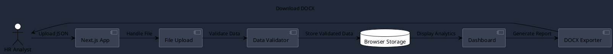
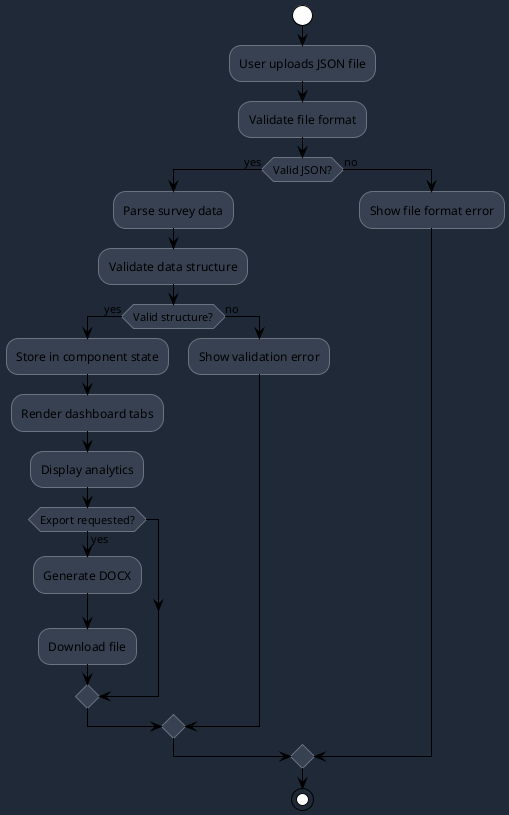
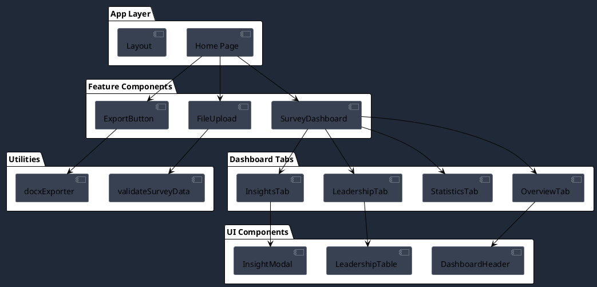

# 🚀 emp – Employee Survey Analytics (Next.js Migration) – Project Review  

> **Repo:** `emp`  
> **Framework:** Next.js 15 (App Router)  
> **Languages:** TypeScript, JavaScript  
> **Styling:** Tailwind CSS 4 + Framer‑Motion + Lucide icons  
> **Build:** Turbopack, ESLint, Prettier  

Below is a deep‑dive into the repository, organized around the six review sections you requested. This document showcases interactive features and advanced markdown capabilities.

:::info
This enhanced documentation includes interactive elements, diagrams, and premium styling to demonstrate the full capabilities of our MarkdownViewer component.
:::

---

## 1️⃣ Application Overview

| Item | Details |
|------|---------|
| **Primary purpose** | Visualise employee survey data from a JSON file; provide a quick analytics dashboard that can be exported to DOCX. |
| **Business domain** | Human Resources / People Analytics. |
| **Target users** | HR analysts, managers, or any stakeholder who owns survey data and wants an instant, shareable snapshot. |
| **Use cases** | • Drag‑and‑drop a survey JSON<br>• Inspect executive summary, key metrics, leadership performance, and qualitative insights<br>• Export the rendered data to a Word document |
| **Core value proposition** | Zero‑setup, instant analytics with a polished UI; eliminates the need to manually copy‑paste or build custom reports. |
| **Architecture pattern** | **Front‑end‑only** SPA built with Next.js. All data is processed in the browser; no persistent backend or database. |

:::success
**Key Strength**: The application provides immediate value without requiring complex setup or backend infrastructure.
:::

### System Architecture

The application follows a client-side processing pattern:



> **Observation:** The "backend" is essentially the browser – great for a self‑contained demo but limits persistence, security, and scalability.

---

## 2️⃣ Technical Stack Analysis

| Layer | Stack | Notes |
|-------|-------|-------|
| **Frontend** | Next.js (App Router), React 19, TypeScript, Tailwind CSS, Framer‑Motion, Lucide icons | Modern stack; strong type safety; Tailwind provides rapid styling. |
| **State mgmt** | Local `useState`, `useCallback`, context not used | Sufficient for current size; could grow to use a state library if needed. |
| **File handling** | Native `FileReader`, custom validation, `docx` & `file-saver` for export | All done on client; no server side. |
| **Testing** | **Missing** | No Jest / React Testing Library. |
| **Linting / Formatting** | ESLint (Next.js config), Tailwind CSS config, Prettier (via ESLint) | Good baseline. |
| **Build** | Turbopack (next dev / build) | Fast builds; upcoming Next.js default. |
| **Deployment** | Not specified (likely Vercel / Netlify) | Static export is trivial. |
| **Third‑party services** | `docx` (doc generation), `file-saver` (file download) | All local; no external APIs. |

:::warning
**Missing Dependencies**: The project lacks testing frameworks and security libraries for HTML sanitization.
:::

---

## 3️⃣ Feature Implementation Flow

The application follows this data processing workflow:



### Error Handling
* **Client‑side**: Uses local `error` state in `Home` page.  
* **Validation**: Basic guard for file type & required fields.  
* **Export**: `try/catch` around doc generation with user‑visible error message.

:::info
**Error Handling Strategy**: The application uses a centralized error state management approach with user-friendly error messages.
:::

---

## 4️⃣ Security Analysis

:::error
**Critical Security Issue**: XSS vulnerability in InsightsTab component requires immediate attention.
:::

* **XSS Risk**: `InsightsTab` renders raw HTML via `dangerouslySetInnerHTML` without sanitisation → potential XSS if JSON contains malicious markup.  
* **No authentication** – Expected for a demo, but if deployed publicly, could expose raw JSON files.

---

## 5️⃣ Implementation Roadmap

Here's a suggested timeline for addressing the identified improvements:

```plantuml
@startuml
!theme plain
skinparam backgroundColor #1f2937
skinparam defaultTextColor #ffffff
skinparam ganttBackgroundColor #374151
skinparam ganttBorderColor #6b7280

@startgantt
title Implementation Roadmap
dateformat YYYY-MM-DD
axisformat %m/%d

section Security
Security Audit           :done, sec1, 2024-01-01, 2024-01-07
HTML Sanitization        :active, sec2, 2024-01-08, 2024-01-14
CSP Implementation       :sec3, after sec2, 7d

section Testing
Test Setup               :test1, 2024-01-15, 2024-01-21
Unit Tests               :test2, after test1, 14d
Integration Tests        :test3, after test2, 7d

section Performance
Code Splitting           :perf1, 2024-02-05, 2024-02-11
Lazy Loading             :perf2, after perf1, 7d
Bundle Optimization      :perf3, after perf2, 5d

section Features
Accessibility            :feat1, 2024-02-19, 2024-02-25
Enhanced Validation      :feat2, after feat1, 7d
Export Improvements      :feat3, after feat2, 7d
@endgantt
@enduml
```

---

## 6️⃣ Component Architecture

The application uses a well-structured component hierarchy:



### Code Quality Metrics

```typescript
// Example of well-structured TypeScript interface
interface SurveyData {
  metadata: {
    title: string;
    date: string;
    participants: number;
  };
  responses: SurveyResponse[];
  analytics: {
    satisfaction: number;
    engagement: number;
    retention: number;
  };
}

// Clean component structure with proper typing
const SurveyDashboard: React.FC<SurveyDashboardProps> = ({ 
  data, 
  onExport 
}) => {
  const [activeTab, setActiveTab] = useState<TabType>('overview');
  
  return (
    <div className="dashboard-container">
      {/* Component implementation */}
    </div>
  );
};
```

---

## 📌 Quick Takeaway

:::success
**Overall Assessment**: emp is a well‑crafted, front‑end‑only Next.js app that transforms employee survey JSON into an interactive, exportable dashboard.
:::

> **emp** is a well‑crafted, front‑end‑only Next.js app that transforms employee survey JSON into an interactive, exportable dashb