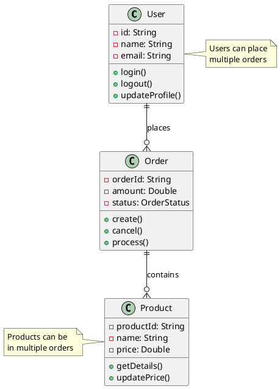
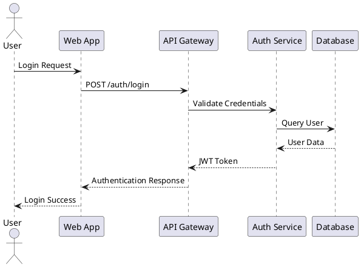
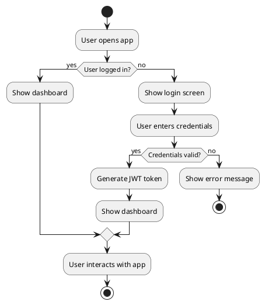
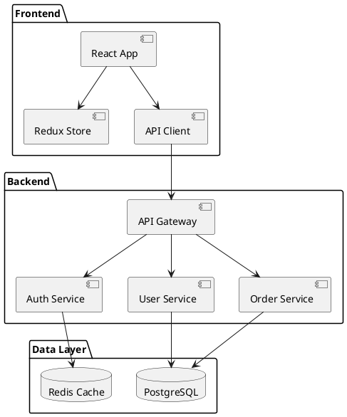
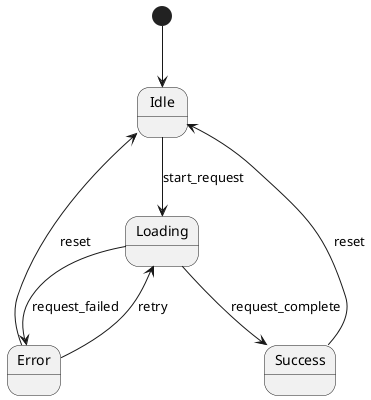

# PlantUML Dark Mode Test

This document tests the improved PlantUML component with dark mode styling.

## Class Diagram

## Sequence Diagram

## Activity Diagram

## Component Diagram

## State Diagram

